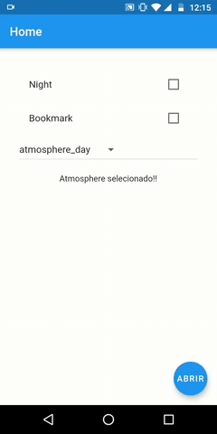
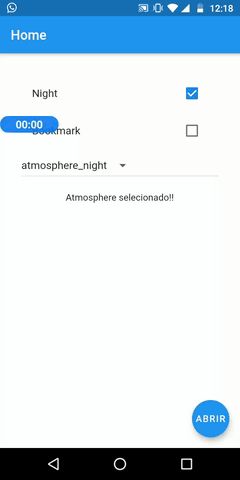
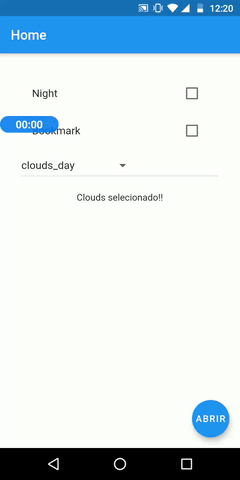
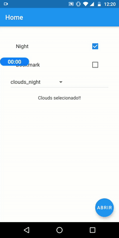
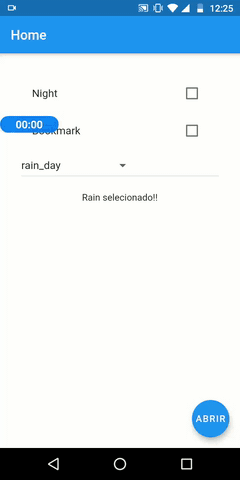
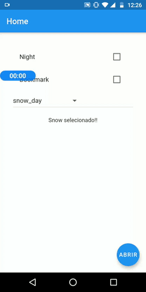
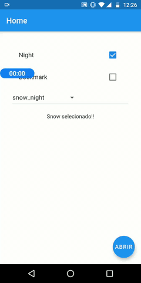
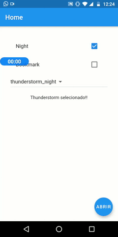

# openweathermap-flutter
Weather, everybody wants to know how it is going to be during the week. Will it be rainy, windy, or sunny? Luckily for us, in the information age, there are open APIs to retrieve information about it.

## Interfaces
- **Atmosphere** (day and night)
- **Clear** (day and night)
- **Clounds** (day and night)
- **Drizzle** (day and night)
- **Rain** (day and night)
- **Snow** (day and night)
- **Thunderstorm** (day and night)

## Product Requirements Reference
https://github.com/lucasmontano/openweathermap
